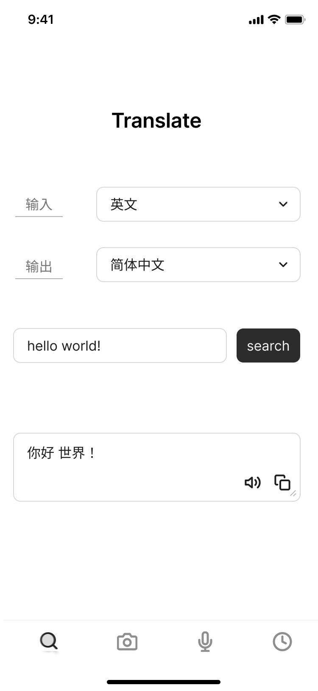
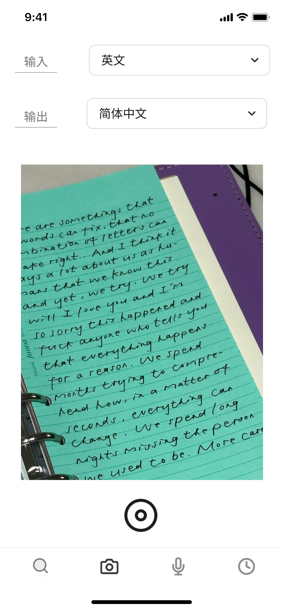
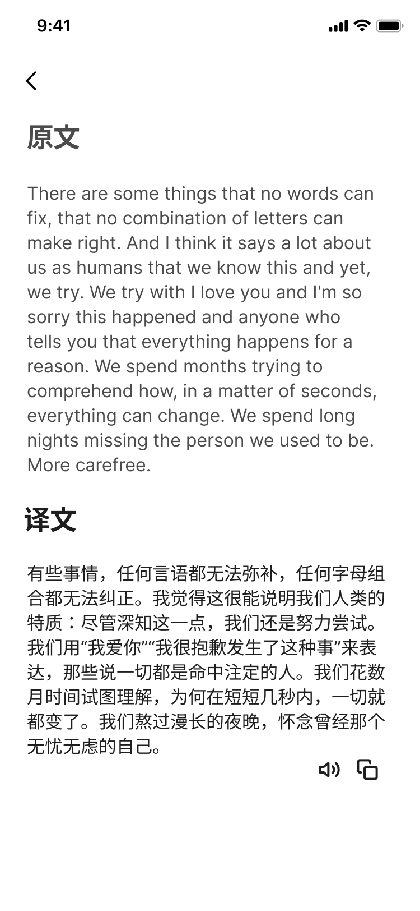
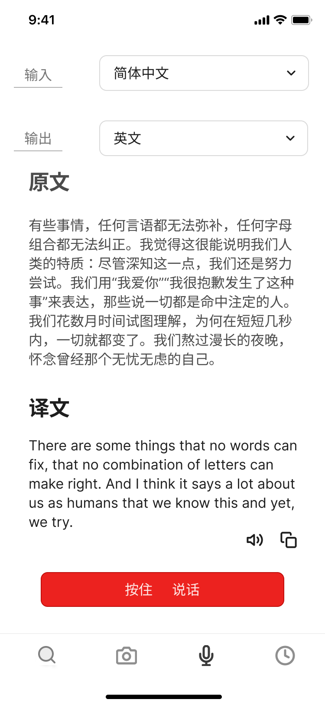
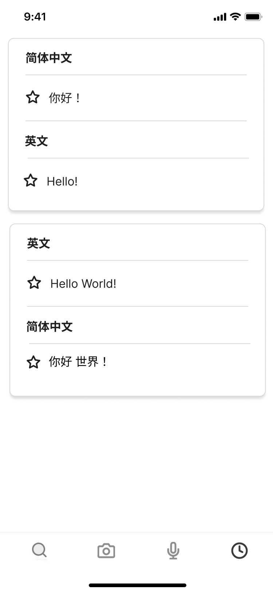
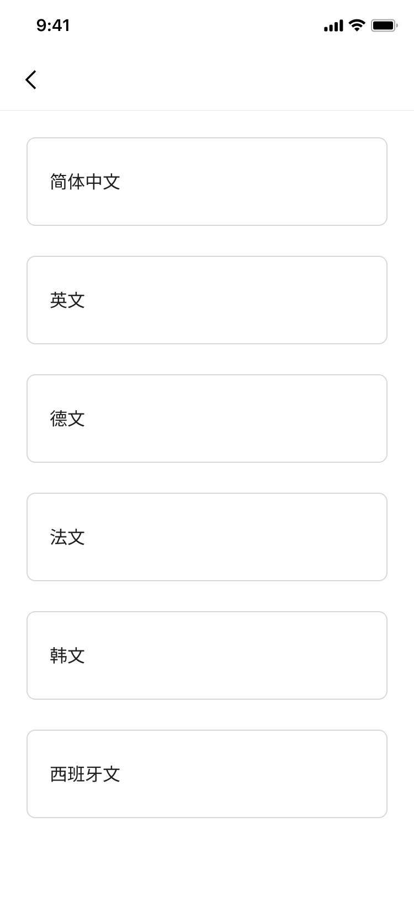

# **界面设计文档**
## **一、概述**
本文档是Andriod翻译APP的界面设计文档。APP的主要功能包括文本翻译、OCR翻译、语音翻译和翻译记录查询。

## **二、主要界面**

1.主页兼文本翻译页

    

2.OCR翻译页

    

3.OCR翻译结果示例页

    

4.语音翻译页

    

5.翻译记录页

    

6.翻译语言选择页

    

### **1.主页兼文本翻译页**

#### **简介**

主页是APP的初始界面，导航栏显示主要信息和主要功能模块，包括文本翻译按钮、OCR翻译按钮、语音翻译按钮和翻译记录按钮.

    

#### **交互场景**

1.用户点击导航栏某一按钮后，跳转到相应的功能模块界面。

2.用户点击输入或输出语言旁边的箭头会跳转语言选择界面。

3.用户在输入框输入文字，点击search按钮开始翻译并显示结果。

4.用户可以在翻译文本栏下方点击语音播放按钮，调用语音合成的模块并播放文本语音.

5.用户亦可以点击复制按钮，快速复制翻译文本。

### **2.翻译语言选择页**

#### **简介**

在语言选择页用户可以选择输入的语言和输出的语言。

    

#### **交互场景**

1.用户点击要选择的语言，图标高亮表示选中。

2.用户点击左上角的返回按钮返回主界面。

### **3.OCR翻译页**

#### **简介**

在OCR翻译页可以选择输入和输出的语言，按下拍照按钮进行翻译。

    

#### **交互场景**

1.用户按下输入或输出语言旁边的箭头跳转到翻译语言选择界面。

2.用户按下拍照按钮，系统识别待翻译文字，跳转到OCR翻译结果界面显示翻译文本。

3.用户点击下方导航栏某一按钮跳转到相应功能界面。

### **4.OCR翻译结果页**

#### **简介**

在OCR翻译结果页显示待翻译原文和翻译结果。

    

#### **交互场景**

1.用户可以在翻译文本栏下方点击语音播放按钮，调用语音合成的模块并播放文本语音。

2.用户可以点击复制按钮，快速复制翻译文本。

3.用户点击左上角返回按钮返回主界面。

### **5.语音翻译页**

#### **简介**

选择输入输出的语言，按住语音按钮说话，显示说话原文和翻译结果。

    

#### **交互场景**

1.用户按下输入或输出语言旁边的箭头跳转到翻译语言选择界面。

2.用户按住语音按钮说话开始录音，再次点击停止录音并显示待翻译原文和翻译结果。

3.用户可以在翻译文本栏下方点击语音播放按钮，调用语音合成的模块并播放文本语音。

4.用户可以点击复制按钮，快速复制翻译文本。

5.用户点击下方导航栏某一按钮跳转到相应功能界面。

### **6.翻译记录页**

#### **简介**

显示翻译记录。

    

#### **交互场景**

1.用户点击下方导航栏相应图标，跳转到翻译记录界面。

2.用户可以滑动屏幕查询所有本地翻译记录。

3.用户点击下方导航栏其他按钮跳转到相应功能界面。

## **三、细节设计**

1.语音翻译和OCR翻译应该提供适当弹窗，引导用户操作。

2.支持用户播放语音和复制译文。

3.翻译进行时显示进度信息，以免误导用户。